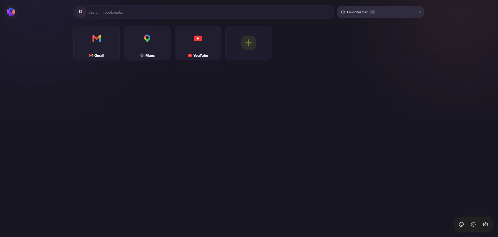
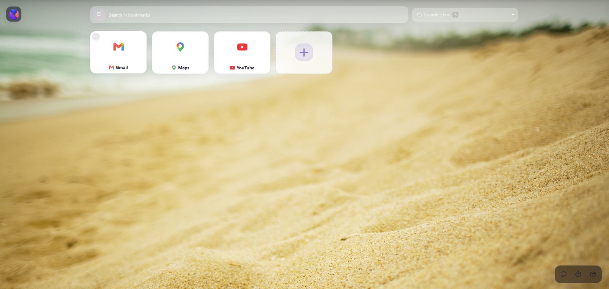
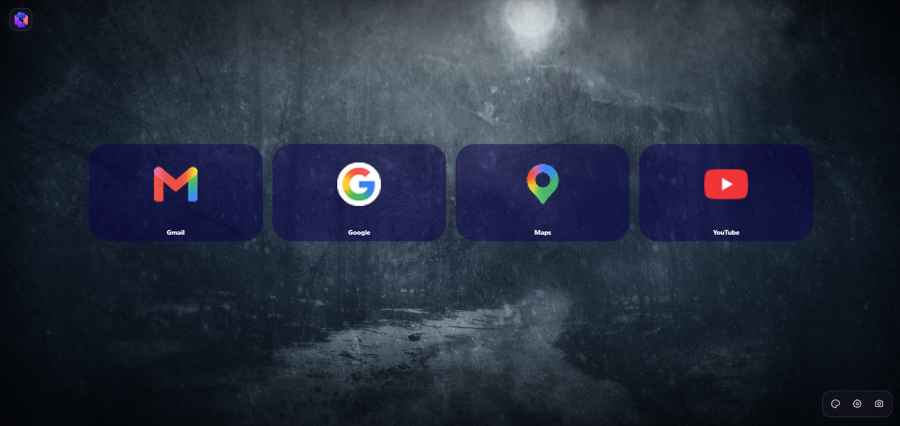
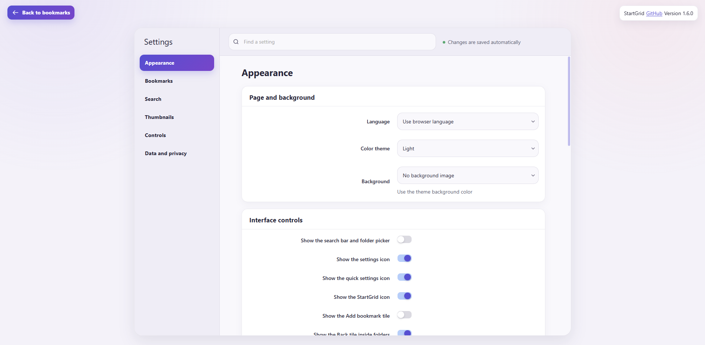
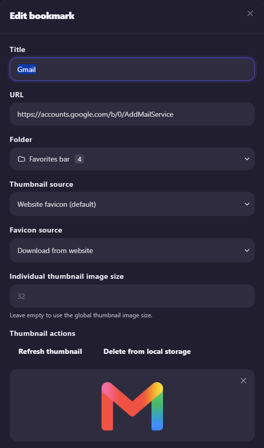
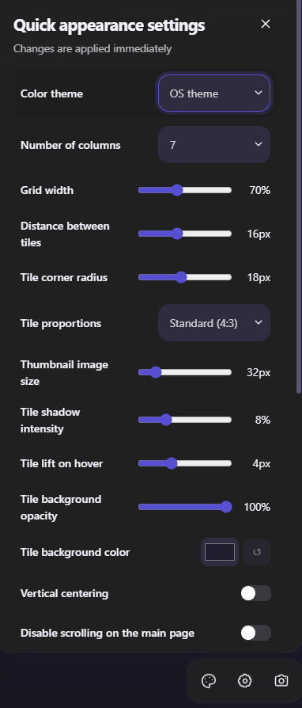

# StartGrid for Chrome

[Русская версия](README.ru.md)

StartGrid replaces Chrome's default new tab page with a clean, customizable space for visual bookmarks. Organize the browser bookmark tree, search the web and your saved pages, group links into folders, customize thumbnails, and tune the layout to match the way you browse.



## Features

- create, edit, delete, and drag bookmarks and folders;
- search bookmarks or use popular web search engines;
- use local, remote, or automatically generated website thumbnails;
- choose between light, dark, and system themes;
- use a local background, an external image, or the Bing image of the day;
- customize the grid, captions, favicons, folder previews, and appearance;
- import and export settings;
- select the interface language independently from Chrome;
- use English, Russian, German, Spanish, French, Hungarian, Japanese, Korean, Polish, Brazilian Portuguese, Simplified Chinese, or Traditional Chinese.

## Screenshots

### Themes and backgrounds





### Settings



| Bookmark editor | Quick appearance settings |
| --- | --- |
|  |  |

## Installation

Ready-to-use ZIP archives are available from [GitHub Releases](https://github.com/KirillShchetinnikov/startgrid-chrome/releases).

1. Download `startgrid-chrome-vX.Y.Z.zip` and extract it to a permanent directory.
2. Open `chrome://extensions`.
3. Enable **Developer mode**.
4. Select **Load unpacked** and choose the directory containing `manifest.json`.

## Building from source

Node.js 20 and npm are required.

```sh
git clone https://github.com/KirillShchetinnikov/startgrid-chrome.git
cd startgrid-chrome
npm ci
npm run build
```

The unpacked extension is generated in `extension_chrome/`. To build a ZIP archive:

```sh
npm run release
```

Main commands:

| Command           | Purpose                                                   |
| ----------------- | --------------------------------------------------------- |
| `npm run dev`     | Build Chrome assets in development watch mode             |
| `npm run build`   | Create a production build                                 |
| `npm run zip`     | Package `extension_chrome/` as `startgrid-chrome.zip`     |
| `npm run release` | Build and package the extension                            |
| `npm run lint`    | Check JavaScript, CSS, and HTML                            |
| `npm test`        | Run the Jest test suite                                    |

## Issues

Found a bug or have an idea? [Open a GitHub issue](https://github.com/KirillShchetinnikov/startgrid-chrome/issues/new).

Please include:

- the StartGrid and Chrome versions;
- clear steps to reproduce the problem;
- the expected and actual behavior;
- screenshots or console errors when they are helpful.

Remove private bookmark URLs, personal data, and other sensitive information before posting.

## Origin

StartGrid was originally based on Ivan Kuzmichov's open-source project [k-ivan/visual-bookmarks-chrome](https://github.com/k-ivan/visual-bookmarks-chrome). It has since been substantially reworked for independent development, including a new visual system and platform layer, additional features, new first-party icons, updated branding, storage architecture, build structure, and release process.

## License

Origin and licensing details are preserved in [NOTICE](NOTICE) and [LICENSE](LICENSE).

[ISC](LICENSE). Copyright © 2026 Kirill Shchetinnikov.
