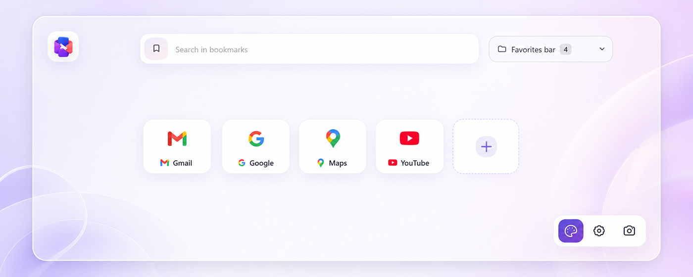

# StartGrid для Chrome

[English version](README.md)

StartGrid заменяет стандартную страницу новой вкладки Chrome на аккуратное пространство для визуальных закладок. Здесь можно управлять деревом закладок, искать страницы, собирать папки, менять миниатюры и настраивать внешний вид панели.



## Возможности

- создание, редактирование, удаление и перетаскивание закладок и папок;
- поиск по закладкам и через популярные поисковые системы;
- локальные, внешние и автоматически созданные миниатюры сайтов;
- светлая, тёмная и системная темы;
- локальный фон, внешний фон или изображение дня Bing;
- настройка сетки, подписей, фавиконов и превью папок;
- импорт и экспорт настроек;
- выбор языка интерфейса независимо от языка Chrome: русский, английский, французский, польский, венгерский, испанский, немецкий, бразильский португальский, японский, корейский, упрощённый и традиционный китайский.

## Установка

Готовые ZIP-архивы публикуются в [GitHub Releases](https://github.com/KirillShchetinnikov/startgrid-chrome/releases).

1. Скачайте `startgrid-chrome-vX.Y.Z.zip` и распакуйте его в постоянный каталог.
2. Откройте `chrome://extensions`.
3. Включите **Режим разработчика**.
4. Нажмите **Загрузить распакованное расширение** и выберите каталог с `manifest.json`.

## Сборка

Требуются Node.js 20 и npm.

```sh
git clone https://github.com/KirillShchetinnikov/startgrid-chrome.git
cd startgrid-chrome
npm ci
npm run build
```

Готовое расширение появится в `extension_chrome/`. Сборка ZIP-архива:

```sh
npm run release
```

Основные команды:

| Команда           | Назначение                                            |
| ----------------- | ----------------------------------------------------- |
| `npm run dev`     | Development-сборка Chrome с наблюдением за файлами    |
| `npm run build`   | Production-сборка Chrome                              |
| `npm run zip`     | Упаковка `extension_chrome/` в `startgrid-chrome.zip` |
| `npm run release` | Сборка и упаковка                                     |
| `npm run lint`    | Проверка JavaScript, CSS и HTML                       |
| `npm test`        | Тесты Jest                                            |

## Сообщения об ошибках и предложения

Если вы нашли ошибку или хотите предложить улучшение, [создайте Issue на GitHub](https://github.com/KirillShchetinnikov/startgrid-chrome/issues/new).

Пожалуйста, укажите:

- версии StartGrid и Chrome;
- понятные шаги для воспроизведения проблемы;
- ожидаемое и фактическое поведение;
- скриншоты или ошибки из консоли, если они помогут разобраться.

Перед публикацией удалите приватные адреса закладок, персональные данные и другую чувствительную информацию.

## Происхождение

За основу был взят открытый проект [k-ivan/visual-bookmarks-chrome](https://github.com/k-ivan/visual-bookmarks-chrome) автора Ivan Kuzmichov. После этого StartGrid был полностью переработан для самостоятельного развития: переписаны визуальная система и платформенный слой, добавлено много новых функций, заменены все собственные иконки, изменены брендинг, структура сборки, пространства хранения и релизный процесс.

## Лицензия

Сведения о происхождении и лицензировании сохранены в [NOTICE](NOTICE) и [LICENSE](LICENSE).

[ISC](LICENSE). Copyright © 2026 Kirill Shchetinnikov.
